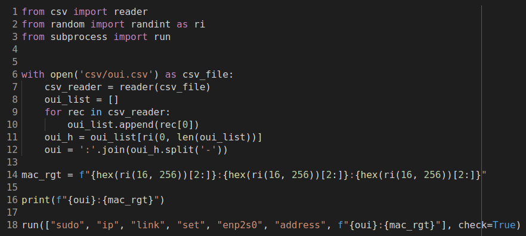

# spoof_mac_addr_nick3499
Spoof MAC address: csv.reader(); random.randrange(); subprocess.run()



- `with open('csv/oui.csv') as csv_f:` defines a `with` statement which opens `csv/oui.csv` and returns a file object.
- `reader(csv_file)` returns a [csv.reader](reader(csv_file)) object.
- `oui_list` lists organizationally unique identifiers (OUIs).

```python
for rec in csv_reader:
    oui_list.append(rec[0])
```

The `for` loop above generates the OUI list stored in `oui_list`.

- `oui_list[ri(0, len(oui_list))]` returns a pseudo-random OUI using the `random.randint` method.
- since the OUIs listed in `oui_list` are hypenated, the single selected OUI must then replace the hypens with colons using `':'.join(oui_h.split('-'))`.
- `f"{hex(ri(16, 256))[2:]}:{hex(ri(16, 256))[2:]}:{hex(ri(16, 256))[2:]}"` returns the totally pseudo-random right side of the MAC address.
- `print(f"{oui}:{mac_rgt}")` prints the MAC address in the terminal emulator for the user to view.
- `run(["sudo", "ip", "link", "set", "enp2s0", "address", f"{oui}:{mac_rgt}"], check=True)` finally passes arguments for the terminal emulator (in this case, Bash).

## csv.reader

[csv.reader](https://docs.python.org/3/library/csv.html#csv.reader) receives the CSV database file `oui.csv`, iterates over its data records, and then returns a reader object. `oui.csv` supports the iterator protocol and returns each record in [list](https://developers.google.com/edu/python/lists) form each time the [`__next__`](https://docs.python.org/3/c-api/iter.html#c.PyIter_Next) method is called.

```python
>>> from csv import reader
>>> with open('csv/oui.csv') as csv_file:
···     csv_reader = reader(csv_file)
··· 
>>> csv_reader
<_csv.reader object at 0x7fcb8c3a8c80>
```

One advantage to using a `with` statement is that it will also close the file after it is through with it, leaving the coder with a `_csv.reader` object.

The [OUI database](http://standards-oui.ieee.org/oui/oui.txt) was used because the random number generator will occassionally return values which the Linux routing socket (RTNETLINK) is unable to assign, based on the specific bits used, and, of course, the rules which must be followed.

## random.randint

```python
from random import randint as ri
```

[random.randint](https://docs.python.org/3/library/random.html#random.randint) builds a range object and returns a pseudo-random integer from a `range(start, stop)` method call.

Along with the `hex` method, the `randint` method can be used to generate two-digit hexadecimal values which are then used in the spoofed MAC address.

```python
>>> from random import randint as ri
>>> hex(ri(16, 256))[2:]
'82'
>>> hex(ri(16, 256))[2:]
'85'
>>> hex(ri(16, 256))[2:]
'2b'
>>> 
```

## subprocess.run

```python
from subprocess import run
```

[subprocess.run](https://docs.python.org/3/library/subprocess.html#subprocess.run) runs the command described by args, waits for that command to complete, then returns a [CompletedProcess](https://docs.python.org/3/library/subprocess.html#subprocess.CompletedProcess) instance.

```python
run(["sudo", "ip", "link", "set", "enp2s0", "address", f"{oui}:{mac_rgt}"], check=True)
```

The args in quotes above are passed to the terminal emulator. See example below:

```sh
$ sudo ip link set enp2s0 address 00:09:03:18:23:7d
```
